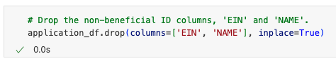
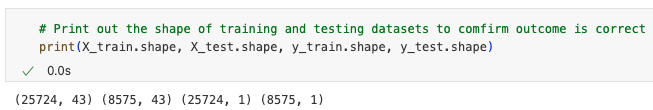
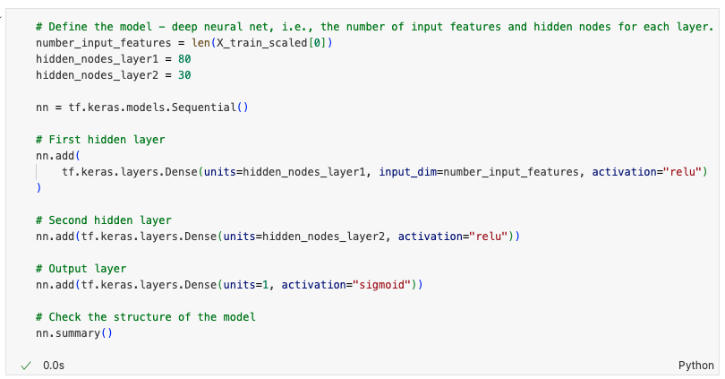
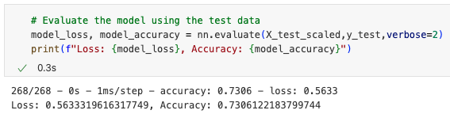
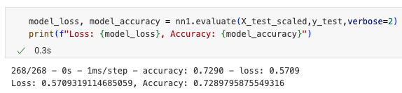
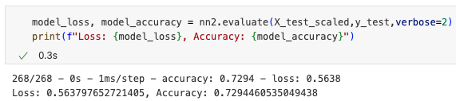
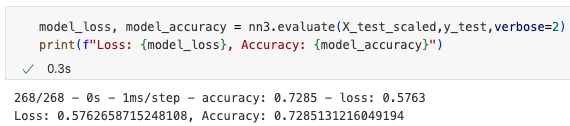
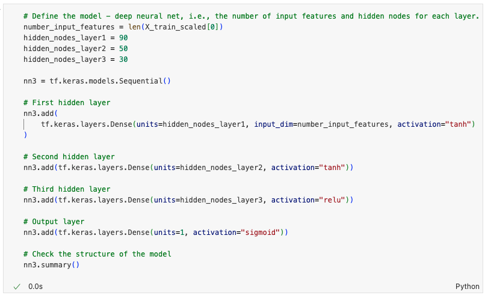

# Module-21-Challenge

## Overview of the Analysis

The purpose of this analysis is to create a binary classifier to predict whether applicants to Alphabet Soup will be successful based on a provided dataset that contains results and metadata from past applications. A deep learning model was developed, and the dataset used to train the model includes 34,299 rows and 12 columns. Below are the columns included, as shown in the instructions.

- **EIN** and **NAME**—Identification columns
- **APPLICATION_TYPE**—Alphabet Soup application type
- **AFFILIATION**—Affiliated sector of industry
- **CLASSIFICATION**—Government organization classification
- **USE_CASE**—Use case for funding
- **ORGANIZATION**—Organization type
- **STATUS**—Active status
- **INCOME_AMT**—Income classification
- **SPECIAL_CONSIDERATIONS**—Special considerations for application
- **ASK_AMT**—Funding amount requested
- **IS_SUCCESSFUL**—Was the money used effectively

## Results

### Data Preprocessing

- What variable(s) are the target(s) for your model? `IS_SUCCESSFUL` column was the variable used as target for my model.

- What variable(s) are the features for your model? `APPLICATION_TYPE`, `AFFILIATION`, `CLASSIFICATION`, `USE_CASE`, `ORGANIZATION`, `STATUS`, `INCOME_AMT`, `SPECIAL_CONSIDERATIONS`, `ASK_AMT` columns are the features used for my model.

- What variable(s) should be removed from the input data because they are neither targets nor features? `EIN` and `NAME` columns were removed from the input data.

### Compiling, Training, and Evaluating the Model

- How many neurons, layers, and activation functions did you select for your neural network model, and why? For my initial model, I wanted to create one with some complexity but not overly complicated. Therefore, I selected a three-layer structure: the first hidden layer, the second hidden layer, and the output layer. The first layer was set with 80 neurons, the second with 30 neurons, and the output layer with 1 neuron. The 80 neurons in the first layer were selected because the model has 43 input features, and it is common to use 2-3 times the number of input features in an initial model. For the 1st and 2nd layer's activation function, I chose ReLU, as it is the most commonly used activation function. And Sigmoid was used for the output layer as it is ideal for binary classifier.

- Were you able to achieve the target model performance? I wasn't able to achieve the target predictive accuracy of 75%. Among my initial model and three optimization attempts, the highest accuracy I achieved was 73.06%. Below are screenshots of the results from the initial model, optimization attempt 1, optimization attempt 2, and optimization attempt 3, respectively.

- What steps did you take in your attempts to increase model performance?

  - **Attempt 1:** I increased the number of nodes in hidden layers: from 80 to 90 in the first layer and from 30 to 50 in the second layer.
  

  - **Attempt 2:** I used different activation functions for the hidden layers: from ReLU to Tanh activation function for the first and second layer.
  

  - **Attempt 3:** I added the third hidden layer with 30 nodes and ReLU activation function.
  

## Summary

Compared to the results of my initial model, the accuracy and loss remained at similar levels despite adjusting the number of neurons in each layer, using different activation functions, and adding additional hidden layers. I would recommend revisiting the data preprocessing stage to determine if there are confusing features that need to be dropped, as including such features can affect the model's ability to learn. Additionally, I suggest using the Keras Tuner library from TensorFlow for hyperparameter tuning automatically, as this library explores various combinations of hyperparameters to find the optimal configuration for achieving the highest performance.

## Resources

Resources that I referred to for completing this homework:

<https://chatgpt.com/>